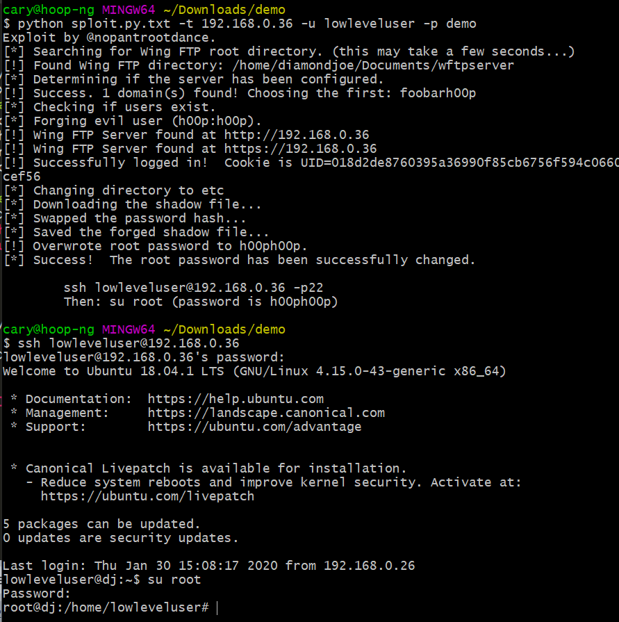

### What's this
Wing FTP Server 6.2.3 - Privilege Escalation

### Exploit

##### Introduction
Wing FTP Server v6.2.3 for Linux, macOS, and Solaris sets insecure permissions on installation directories and configuration files. This allows local users to arbitrarily create FTP users with full privileges, and escalate privileges within the operating system by modifying system files.

##### Tested on
Ubuntu 18.04, Kali Linux 4, MacOS Catalina, Solaris 11.4 (x86)

##### Exploit
~~~
python3 cve-2020-8635.py -t 192.168.0.2:2222 -u lowleveluser -p demo 
~~~

